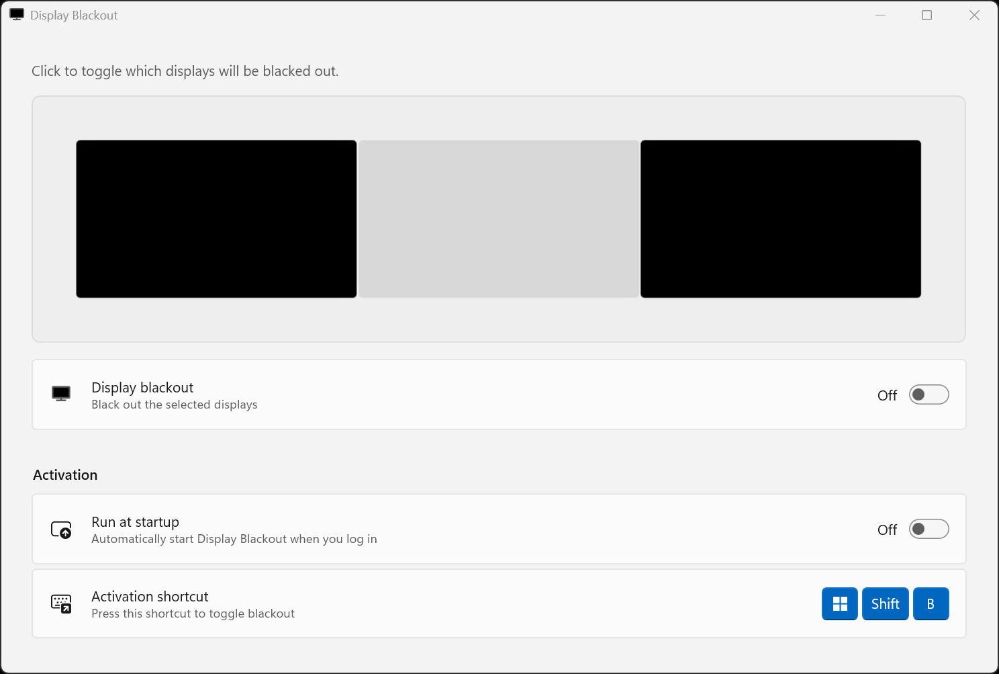

# Display Blackout

A Windows 11 system tray utility that blacks out selected displays on demand. Useful for reducing distractions while gaming, focusing on a single monitor, or dimming secondary displays during video calls.

## Features

- **Selective blackout**: Choose which displays to black out via a visual monitor picker
- **Global hotkey**: Toggle blackout with Win+Shift+B
- **System tray integration**: Quick access from the notification area
- **Start with Windows**: Optional auto-start on login
- **Lightweight**: Native AOT compiled, no .NET runtime required

## Screenshots



See the [`screenshots/`](./screenshots/) folder for more.

## Requirements

- Windows 11 version 24H2 or later

## Installation

<!-- TODO: Add Microsoft Store link once published -->

Coming soon to the Microsoft Store.

## Building from source

Prerequisites:

- Visual Studio 2026 with the "Windows application development" workload
- Windows 11 SDK (10.0.26100.0)
- .NET 10 SDK

```sh
dotnet build DisplayBlackout -c Release
```

## Privacy and security

This app requires no administrator elevation, makes no network requests, and collects no telemetry or user data. Settings are stored locally via the standard Windows packaged app settings API.

The app has a setting to allow itself to be run on startup, but it is off by default. It uses the modern [`StartupTask`](https://learn.microsoft.com/en-us/uwp/api/windows.applicationmodel.startuptask?view=winrt-26100) API so it is fully controllable via the Windows Settings app's "Apps > Startup" section.

## Technical design and background

I wrote this app partially to solve a real-world need, but mostly as a learning experience. In particular, I wanted to practice using [Claude Code](https://claude.com/product/claude-code), and I wanted to learn what the state of modern native Windows app development was like.

### Technology choices

I ended up picking the following technology stack:

- **WinUI 3**. This appears to be the most recent first-party solution for building native Windows UIs. It's not great: the community seems fractured from the Windows Forms → WPF → UWP → WinUI transition, and the WinUI project doesn't seem to be maintained. I now understand why modern Windows apps are so often webview-based; if I were not building this app specifically to learn, I would probably use [Tauri](https://tauri.app/).

  Other possibilities that I learned about include the third-party libraries [Avalonia](https://avaloniaui.net/) and [Uno Platform](https://platform.uno/). They appear to be better maintained than Microsoft's WinUI. But their emphasis on cross-platform development was unnecessary for my case, and I'm sure they have their own problems. If I really loved building apps in .NET, maybe they would be a better choice for future projects. (But again, more likely I would just use Tauri.)

- **C# over C++**. This was a hard decision. Bringing along the entire .NET runtime for an app like this seems a bit wasteful. I'm disappointed that Microsoft is still not distributing the latest versions of .NET via Windows updates, so one cannot count on it being preinstalled. (Apparently Windows 11 only includes the legacy .NET Framework 4.8.x, which is 6 versions behind the modern .NET 10!) And for this application in particular, an unfortunate amount of code is just doing P/Invoke calls down to low-level Win32 APIs, which is somewhat ugly in C#.

  However, writing an application in a memory-unsafe language like C++ in the year 2026 is somewhat of a crime. And, several dependencies that I wanted to use are already .NET-dependent. So, C# it is.

- **.NET AOT over framework-dependent deployment**. It seems much nicer if all the apps on a user's machine could share the .NET runtime. However, because Microsoft does not preinstall any such runtime, there's a tragedy of the commons problem where the first app to need it will have a degraded user experience, causing Windows to show a dialog prompting them to download and install .NET on first launch. This is pretty ridiculous. It's not even a hit at install-time from the Windows Store; it's a hit at runtime. (It _could_ become a part of the Store install flow, but Microsoft has decided not to publish a .NET MSIX framework package for some reason. They did it for the Windows App SDK Runtime, i.e., the WinUI code, but not for .NET!)

  Thus, this application succumbs to the tragedy of the commons along with all the others, and uses .NET AOT and trimming to bundle the appropriate parts of the .NET runtime into its distributed binary. What a waste.

- **When in doubt, emulate PowerToys**. The [PowerToys](https://github.com/microsoft/PowerToys/) project was the best example of a complex, modern, and open-source WinUI app that I could find. I took inspiration from it on various UI patterns.

- **Other miscellaneous decisions**:
  - Support both x64 and ARM64, to be a good citizen.
  - MSIX instead of a `.exe`/XCOPY install flow, to be a good citizen.
  - Only target the latest Windows and .NET, because this is a hobby project and I don't want to worry about adding any fallback code.
  - Attempt to automate publication as much as possible via GitHub Actions CI.

### Known limitations

**No display numbers in the monitor picker.** Unlike Windows Display Settings, the monitor picker UI doesn't show numbered labels (1, 2, 3) on each display. This is because there's no public Windows API to retrieve those numbers. I tried GDI device names (`\\.\DISPLAY1`), various `QueryDisplayConfig` fields, and more—none match the numbers that Windows shows.

According to Claude, apps like NVIDIA Control Panel get this right because they use proprietary NVAPI/NVWMI APIs with access to low-level driver information. That would require NVIDIA-specific dependencies and only work on NVIDIA hardware, so I decided against it. Instead, users can identify monitors by their visual position and aspect ratio, which we take pains to reproduce.

**No automatic blackout on game launch.** I originally planned to add a mode that automatically switched to blackout  when fullscreen games launch, using `SHQueryUserNotificationState` (the same approach PowerToys uses). However, this API doesn't really seem to detect games very well, based on my initial testing:

- It has false negatives, like not detecting _Hades II_.
- It has false positives, like blacking out a display (for which I had to implement [a fun workaround](./DisplayBlackout/BlackoutOverlay.cs)).

In the future, I might try harder to figure something out for this, or add a user-configured process allowlist/blocklist.
